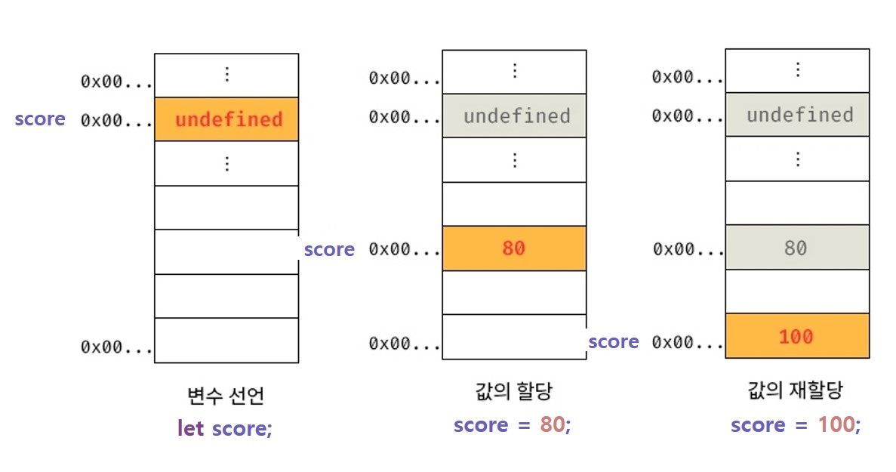
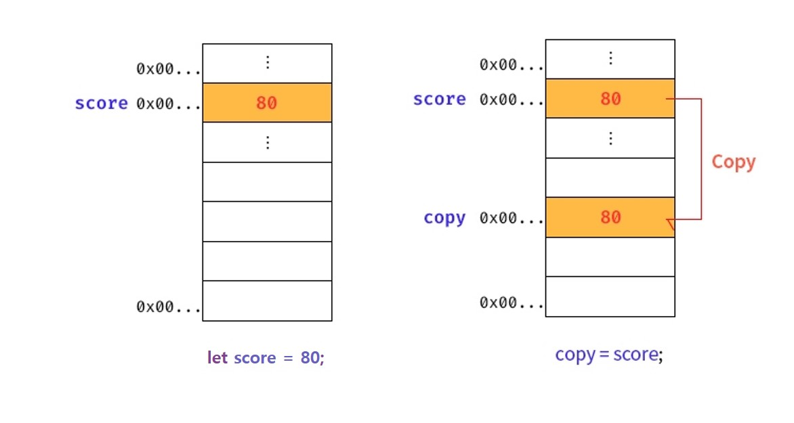
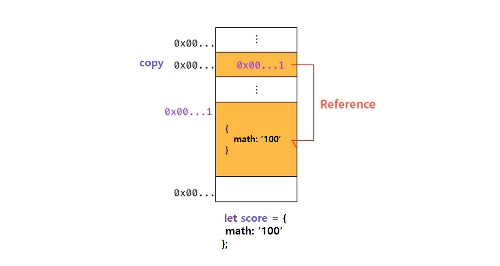
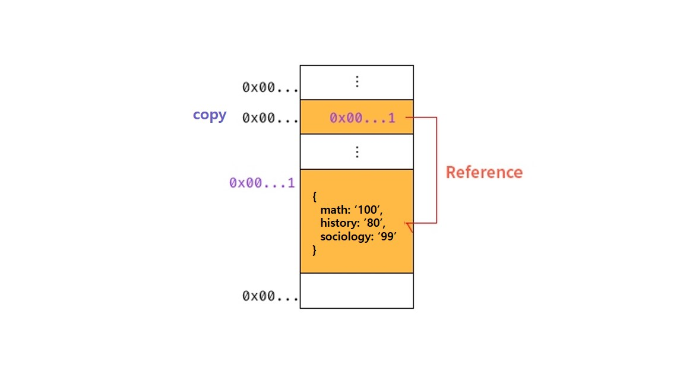

---
emoji:
title: 데이터 타입
date: '2023-07-13 23:27:00'
author: 허원호
tags: javascript, 자바스크립트 딥다이브
categories: 자바스크립트 딥다이브
---

## 원시타입과 객체 타입

> Number, String, Boolean, undefined, null, Symbol은 원시 타입입니다. 그 외는 객체 타입(Object, Array)

- 원시타입은 변경불가능(immutable)한 값 이며 객체타입은 변경 가능한(mutable) 값이다.
- 원시 값을 변수에 할당하면 메모리에 실제 값이 저장되며 객체를 변수에 할당하면 참조 값이 저장됨
- 원시 값을 갖는 변수를 다른 변수에 할당하면 원본의 원시값이 복사되어 전달(**값에 의한 전달**)
- 객체 값을 갖는 변수를 다른 변수에 할당하면 원본의 참조 값이 복사되어 전달(**참조에 의한 전달**)

#### 원시 값은 변경 불가능하다?

변수의 값을 변경하지 못하는 것이 아니라 원시 값 자체를 변경할 수 없다는 의미

아래 이미지는 원시 값을 가지는 변수에 값을 재할당하는 경우 메모리에서 발생하는 현상을 그림으로 표현한 것이다.



변수의 값을 다른 변수에 할당할 때는 아래와 같이 동작한다



값의 이러한 특성을 **불변성**이라고 함

```javascript
let score = 80;
let copy = score; // score에 새로운 숫자 값인 80이 복사되어 전달되었기 때문에 원본 값에 영향을 미치지 못함 (위의 이미지와 같이 전혀 다른 메모리 공간에 저장됨)

score = 100;

console.log(score); // 100
console.log(copy); // 80
```

<br />

#### 문자열의 경우에는?

1개의 문자는 2바이트의 메모리 공간에 저장되기 때문에 문자열의 길이 만큼 필요한 메모리 크기의 공간이 결정됨

문자열은 유사 배열 객체이면서 이터러블(순회 가능한 객체)이므로 배열과 유사하게 문자에 접근이 가능함

```javascript
let string = 'string';

string[0]; // s

string.length; // 6

string[0] = 'b';
string; // "string" // 문자열 또한 원시 값으로써 불변성을 지니기 때문에 읽기 전용 값임
```

---

## 원시타입

<br/>

### 숫자 타입

64비트 부동 소수점 형식을 따르며 모든 수를 실수로 처리
Infinity, -Infinity, NaN(산술 연산불가)의 특별한 값도 포함됨

<br/>

### 문자열 타입

작은따옴표(''), 큰따옴표(""), 백틱(``)으로 감싸서 표현

- 감싸지 않을경우 자바스크립트 엔진이 키워드나 식별자로 판단하여 에러가 발생할 수 있음

#### 템플릿 리터럴

위의 표현 형태 중 백틱을 사용
문자열 내에 공백, 줄바꿈을 주려면 [이스케이프 시퀀스](https://ko.wikipedia.org/wiki/%EC%9D%B4%EC%8A%A4%EC%BC%80%EC%9D%B4%ED%94%84_%EC%8B%9C%ED%80%80%EC%8A%A4)를 사용

```javascript
let a = 'deep Dive';
'javascript ' + a; // + 연산자를 사용하여 표현식을 삽입
`javascript ${a}`; // ${} 을 사용하여 표현식을 삽입
```

### 불리언 타입

```javascript
let a = false; // 거짓
let b = true; // 참
```

### undefined 타입

var 나 let으로 선언한 변수의 초기화 값
개발자가 의도적으로 할당하는 것은 본래 취지에 어긋나므로 null을 사용하여 변수의 값이 없음을 표현하는 것을 권장

### null 타입

프로그래밍에서 null은 변수에 값이 없음을 의도적으로 명시할 때 사용
변수에 null을 할당한다는 것은 변수의 값을 더이상 참조하지 않겠다는 의미
null 이 할당되었으므로 참조하던 메모리 공간에 가비지 콜렉션을 수행

### 심벌 타입

ES6에서 도입되었으며 변경 불가하고 다른 값과 중복되지 않는 유일 무이한 값

```javascript
let a = Symbol('value');
console.log(typeof a); // symbol

const object = {};
object[a] = 'bbc';
```

---

## 객체 타입

> 자바스크립트를 이루고 있는 거의 모든 것이 객체로 이루어짐

프로퍼티의 개수가 정해져 있지 않고 동적으로 추가되고 삭제됨

객체는 변경가능한 값이며 변수에 할당된 객체는 메모리 공간의 실제 값을 직접 참조하는 것이 아닌 객체가 실제로 저장된 메모리에 참조된 참조 값에 접근함

참조 값이 복사되어 전달되는 (**참조에 의한 전달**)



```javascript
let object = {
  math: '100',
};

object.history = '80';
object.sociology = '99'; // 객체를 변수에 재 할당하지 않았기 때문에 참조 값은 변하지 않음
```



하지만 이러한 구조 때문에 여러 개의 식별자가 하나의 객체를 공유할수 있게 됨

### 얕은 복사와 깊은 복사

```javascript
const original = { name: '철수', age: 12 };
const clone = original;
console.log(clone === original); //true

clone.name = '영희';
console.log(original.name); //영희
```

단순히 위와 같이 객체를 다른 변수에 재 할당하게 될 경우 복사된 변수가 참조하는 값은 원본 변수의 참조 값과 동일하게되어 객체 값을 수정 할 시 양쪽 변수에 영향을 주게 됨

#### 얕은 복사

> 객체를 한단계 까지만 복사

```javascript
// Object assign 과 ES6 의 spread 연산자를 통해 복사
const original = { name: '철수', age: 12 };
const clone = Object.assign({}, original);
const clone2 = { ...original };
clone.name = '영희';
clone2.name = '뚱이';

console.log(original); // {name: '철수', age: 12}
console.log(clone); // {name: '영희', age: 12}
console.log(clone2); // {name: "뚱이", age: 12}
```

#### 깊은 복사

> 중첩된 객체를 모두 복사

```javascript
// lodash의 _.cloneDeep, JSON, structuredClone(chrome 98 이상부터 지원)
const _ = require('lodash');

const original = { profile: { name: '철수', age: 12 }, grade: 'A' };
const clone = _.cloneDeep(original);
const clone2 = JSON.parse(JSON.stringify(original));
const clone3 = structuredClone(original);

clone.profile.name = '영희';
clone.grade = 'B';

console.log(original); // {profile: {name: '철수', age: 12}, grade: 'A'}
console.log(clone); // {profile: {name: '영희', age: 12}, grade: 'B'}
```

값에 의한 전달과 참조에 의한 전달은 식별자가 기억하는 메모리 공간의 저장된 값을 복사해서 전달한다는 면에서 동일하지만 변수에 저장된 값이 원시 값이냐 참조 값이냐에 대한 차이만 존재함

이로써 참조에 의한 전달은 존재하지 않고 값에 의한 전달 만이 존재 함

---

## 동적 타입 과 정적 타입

| 정적 타입                                                    | 동적 타입                                                                                                    |
| ------------------------------------------------------------ | ------------------------------------------------------------------------------------------------------------ |
| 데이터 타입을 사전에 선언해야함 <br/> (**명시적 타입 선언**) | 선언이 아닌 할당에 의해 타입이 결정(**타입 추론**)됨 <br/> 재할당에 의해 변수의 타입은 동적으로 변할 수 있음 |
