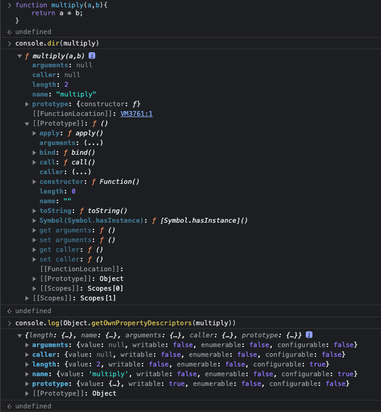

---
emoji:
title: 함수와 일급 객체
date: '2023-07-19 23:19:00'
author: 허원호
tags: javascript, 자바스크립트 딥다이브
categories: 자바스크립트 딥다이브
---

# 일급 객체

1. 무명의 리터럴로 생성할 수 있음(런타임에 생성이 가능함)
2. 변수나 자료구조(객체, 배열 등)에 저장할 수 있다.
3. 함수의 매개변수로 전달 할 수 있다.
4. 함수의 반환값으로 사용할 수 있다.

> 일급 함수?
> 일급 함수란 함수를 일급 객체로 취급하겠다는 의미이며 자바스크립트는 함수도 객체로 표현하기 때문에 일급함수 또는 일급 객체라고 부를 수 있다.

객체는 값이므로 함수도 값과 동일하게 취급할 수 있으며 값을 사용할 수 있는 곳이라면 어디서든 리터럴로 정의할 수 있고 런타임 함수 객체로 평가된다.

# 함수 객체의 프로퍼티

함수 객체 내부의 모든 프로퍼티를 확인해보면 다음 과 같다



`arguments`, `caller`, `length`, `name`, `prototype` 프로퍼티는 모두 함수 객체의 데이터 프로퍼티이다.
하지만 `__proto__` 는 접근자 프로퍼티이며 `Object.prototype` 객체의 프로퍼티를 상속받은 것 을 알 수 있다.
즉 `Object.prototype` 객체의 프로퍼티는 모든 객체가 상속받아 사용할 수 있다.

## arguments 프로퍼티

함수 호출 시 전달된 인수 정보를 담고 있는 iterable(순회 가능한) 유사배열 객체이며 함수 내부에서 지역 변수처럼 사용된다.

> 유사배열객체
> 배열이 아니기 때문에 배열 메서드를 사용할 수 없다!
> `Function.prototype.call, Function.prototype.apply`를 사용해 간접 호출해서 배열메서드를사용가능

- arguments 객체의 Symbol(Symbol.iterator) 프로퍼티는 arguments 객체를 순회 가능한 자료구조인 iterable로 만들기위한 프로퍼티 이다.

  ```js
  function multiply(a, b) {
    const iterator = arguments[Symbol.iterator]();

    console.log(iterator.next()); // { value: 1, done: false }
  }

  multiply(1, 2, 3);
  ```

argument 객체는 매개변수의 개수를 확정할 수 없는 가변인자 함수 구현 시 유용하다!

## caller 프로퍼티

비표준 프로퍼티이며 함수 자신을 호출한 함수를 가리킴

## length 프로퍼티

함수를 정의할 때 선언한 매개변수의 개수

## name 프로퍼티

함수의 이름을 나타내며 ES6에서 표준화됨
익명 함수 표현식의 경우 ES5는 빈 문자열을, ES6는 함수 객체를 가리키는 식별자를 값으로 가짐

## `__proto__` 접근자 프로퍼티

모든 객체는 [[Prototype]] 이라는 내부슬롯을 가지며 프로토타입 객체를 가리킴
`__proto__`프로퍼티는 [[Prototype]] 내부슬롯이 가리키는 프로토 타입 객체에 접근하기위해 사용하는 접근자 프로퍼티이다.

## prototype 프로퍼티

생성자 함수로 호출할 수 있는 함수객체 constructor 만이 소유하는 프로퍼티
