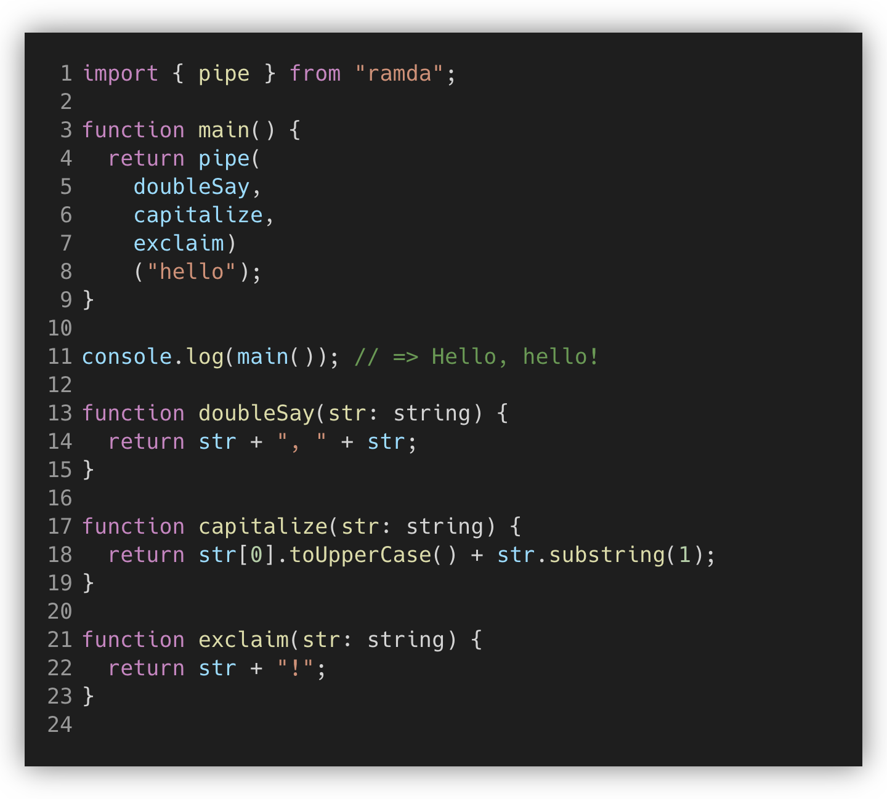

---
emoji:
title: Functional Programing Js Library
date: '2023-02-02 16:18:00'
author: 허원호
tags: functional, fp, javascript, lodash, fxts
categories: 블로그
---

# Functional Programing Js Library

# 메서드 체이닝 과 메서드 파이프라인

## lodash 메서드 체이닝

```jsx
import _ from 'lodash';

_.chain(names)
  .map((name) => name.replace(/()_|-/, ' '))
  .map(_.startCase)
  .sort()
  .value();
```

## ramdajs 메서드 파이프라인

```jsx
import { replace, toUpper, map, pipe, sortBy, identity } from 'ramda';

const startCase = (str) => {
  return replace(/(\b\w(?!\s))/g, toUpper, str);
};

pipe(map(replace(/(_|-)/, ' ')), map(startCase), sortBy(identity))(names);
```

## 메서드 체이닝과 메서드 파이프라인의 차이점

```jsx
const person = {
  name: 'Nakta',
  age: 31,
  work: 'programmer',
};
```

- age 필드를 지운다.
- work 필드 명을 job 으로 바꾼다.

**메서드 체이닝 (단단한 결합)**

```jsx
const rename = (keysMap, obj) => {
  ... // 구현부 생략
}

const omittedAge = _.chain(person)
 .omit(['age'])
 .value()

const result = rename({work: 'job'}, omittedAge)
```

**메서드 파이프라인 (느슨한 결합)**

```jsx
const rename = (keysMap, obj) => {
  ... // 구현부 생략
}

pipe(
  omit(['age']),
  rename({work: 'job'})
)(person)
```

# lodash([lodash/fp](https://github.com/lodash/lodash/wiki/FP-Guide))

## 특징

- Promise는 기본적으로 지원되지 않음
- 오토커링 지원

```jsx
// The `lodash/map` iteratee receives three arguments:
// (value, index|key, collection)
_.map(['6', '8', '10'], parseInt);
// ➜ [6, NaN, 2]

// The `lodash/fp/map` iteratee is capped at one argument:
// (value)
fp.map(parseInt)(['6', '8', '10']);
// ➜ [6, 8, 10]
```

- fp에서 추가된 함수 존재
- placeholder

```jsx
// The equivalent of `2 > 5`.
_.gt(2)(5);
// ➜ false

// The equivalent of `_.gt(5, 2)` or `5 > 2`.
_.gt(_, 2)(5);
// ➜ true
```

- [eslint-plugin-lodash-fp](https://www.npmjs.com/package/eslint-plugin-lodash-fp)

# [ramdajs](https://ramdajs.com/)

## 특징

- immutability과 side-effect 발생하지않도록 순수 함수적 스타일을 강조
- 람다의 모든함수는 오토커링을 지원

```jsx
const comment = {
  author: 'test',
  body: 'comment...',
  recommentId: 'uuid-1234',
};

// lodash
const body = { ..._.omit(comment, ['author', 'recommentId']) };

// ramda
const ejectProps = R.omit(['author', 'recommentId']);

const body = { ...ejectProps(comment) };
```

- 재사용 가능한 함수

```jsx
const response1 = ['ramda', 'lodash'];

const response2 = ['functional', 'programming'];

const withHashStr = (str) => '#' + str;

const hashStr = R.map(withHashStr); // #을 붙여주는 hash 함수를 선언하여 재사용가능

const ramdaLodash = hashStr(response1);

const functionalProgramming = hashStr(response2);
```

- 함수에 대한 매개 변수는 마지막에 제공

## 주요 기능

- Pipe



# [Fx ts](https://fxts.dev/)(partial.js)

## 특징

- 지연평가
- 동시 요청 처리
- 타입 추론
- iteration protocol 준수 (반복가능, 비동기 가능)

## 샘플코드

```jsx
import { pipe, omit, keys, map, toArray } from '@fxts/core';

const person = {
  name: 'Nakta',
  age: 31,
  work: 'programmer',
};

const assign = (target) => (source) => {
  return Object.assign(target, ...source);
};

const rename = (keysMap) => (obj) => {
  return pipe(
    keys(obj),
    map((k) => {
      const newKey = keysMap[k] || k;
      return { [newKey]: obj[k] };
    }),
    toArray,
    assign({}),
  );
};

const result = pipe(person, omit(['age']), rename({ work: 'job' }));
// ramda 와 유사

console.log('result', result);
```

# [fp-ts](https://gcanti.github.io/fp-ts/)

## 특징

- [Haskell](https://www.haskell.org/), [PureScript](https://www.purescript.org/), [Scala](https://www.scala-lang.org/)와 같은 언어에서 추출된 추상화를 포함하는 고차 추상화를 초점에 둔 라이브러리
- Rescript에서 지원하는 유사한 함수들이 존재

## 주요 기능

- Pipe
  
  - 입력값이 첫번째에 위치
- \***\*[fp-ts를 이용한 비함수형 코드와의 상호 운용성](https://alstn2468.github.io/TypeScript/2021-04-21-fp-ts-0/)\*\***
