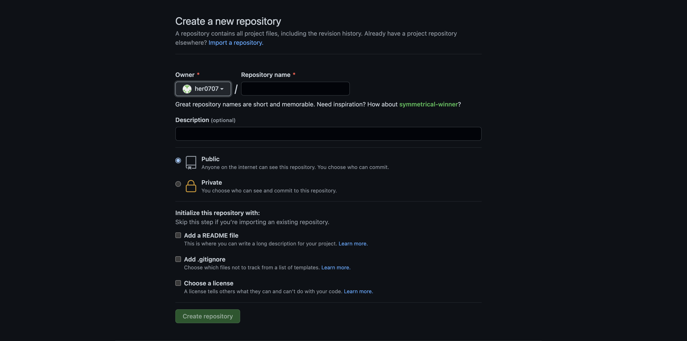
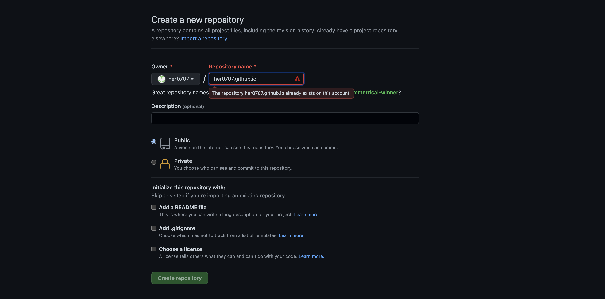
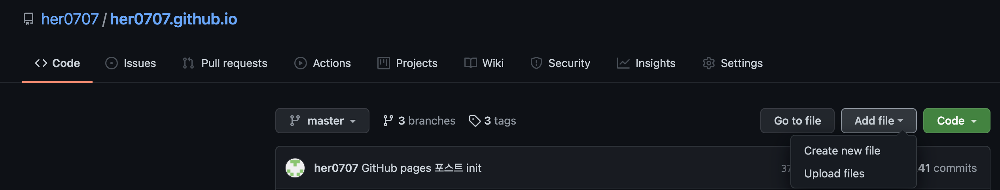
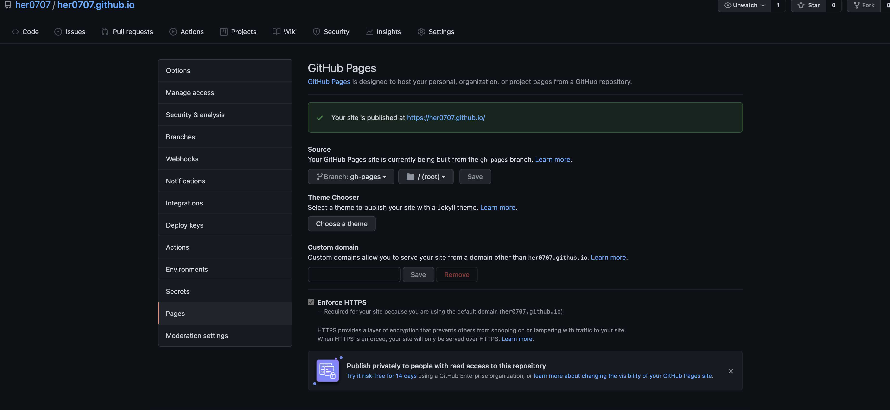

## 👋 소개

평소에 개발 관련 이슈나 노트 내용을 정리하고 글로 작성할 블로그형태를 찾다가 뒤늦게 나마 GitHub Pages 기능을 활용하여 블로그를 만들게 되었습니다.
그에 따라 평소에 GitHub Pages에 관심이 있으신 분들을 위해 생성 방법에 대해 공유하려고 합니다.

## GitHub Pages 란?

웹서버의 경우 직접 웹서버용 PC를 이용하여 운용하는 것은 쉽지 않은 일이며 관리에도 힘이 들기 떄문에 주로 웹호스팅 업체를 사용하여 웹서버에 어플리케이션을 업로드합니다

국내의경우 Cafe24, 가비아, dothome 등의 호스팅 업체들이 있으며 세계적으로는 Amazon Web Services (AWS)를 많이 사용하는 추세입니다.

AWS의 경우 세계 각 지역에 데이터센터를 두고 있어 한국에서도 사용하는데 큰 어려움이 있지는 않습니다.

2021년 들어 주목해볼 고객 사례로 AWS측에서 발표한 링크도 추가해 두겠습니다.

https://aws.amazon.com/ko/blogs/korea/2020-customer-cases/

우선 우리는 그중에서 대표적인 무료 Git 저장소이며 사용량도 굉장히 많은 GitHub의 웹 호스팅 서비스인 GitHub Pages를 이용해보고자 합니다.

## 1. Repository 생성하기

GitHub Pages를 만들려면 우선 GitHub 계정에 Repository를 생성해주셔야 합니다.

Repository name의 경우에는 GitHub의 {username}.github.io 로 지정해주시면됩니다.

그리고 생성하기를 클릭해주시면 GitHub 계정에 정상적으로 Repository가 생성됩니다. 

## 2. 호스팅할 프로젝트 및 파일 업로드

Git Gui 클라이언트를 사용하여 해당 Repository clone 진행 이 후 신규파일 commit push 로 진행하실 수 도 있으며

Add file을 통해 Repository에 직접 업로드 할 수 있습니다.

## 3. 호스팅 설정

Repository 메뉴의 Settings로 이동 후 Pages 탭에서 Source에 Branch 와 경로선택 후 Save를 클릭 해 주시면 됩니다.

## 마무리

여기까지가 아주 간략하게 설명한 GitHub Pages를 사용한 웹 호스팅 방법이었습니다.

저도 해당기능을 이용하여 이 블로그 형태의 사이트를 호스팅하여 포스팅 예정입니다.

