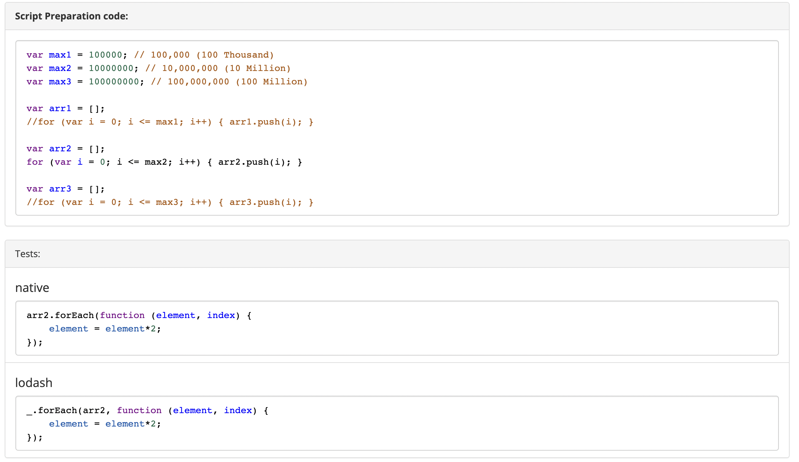
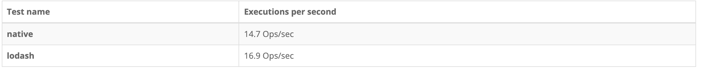

---
emoji:
title: Lodash.js
date: '2023-02-02 16:18:00'
author: 허원호
tags: lodash, javascript
categories: 블로그
---

# Lodash.js

## [소개(문서)](https://lodash.com/docs/4.17.15)

- 인기있는 JavaScript 라이브러리 중 하나로 주로 Array, Collection, Object등의 데이터 구조를 Native 함수보다 쉽게 사용할 수 있도록 지원해 주는 역할을 합니다.

```jsx
// 전체 Methods import
import _ from 'lodash';

// 특정 Method import
import filter from 'lodash/filter;
import { filter } from 'lodash;
```

- lodash라는 명칭대로 전체 라이브러리를 import 할 경우 위의 방식으로 주로 사용하며 프로젝트 번들 최적화 시 사용할 Method 만 호출하여 사용하는 방식을 이용합니다.
- tree-shaking 방식을 통해 번들 용량을 좀 더 최적화 시킬 수 있는 lodash-es 라이브러리도 존재합니다.(es모듈형태)

## Methods

- Array Methods
  **`_.findIndex(array, [predicate=_.identity], [fromIndex=0])`**

  - arguments
    - **`array`** **_(Array)_**
    - **`[predicate=_.identity]`** **_(Function)_**
    - **`[fromIndex=0]`** **_(number)_**
  - return: index number

  ```jsx
  var users = [
    { user: 'barney', active: false },
    { user: 'fred', active: false },
    { user: 'pebbles', active: true },
  ];

  _.findIndex(users, function (o) {
    return o.user == 'barney';
  });
  // => 0

  // The `_.matches` iteratee shorthand.
  _.findIndex(users, { user: 'fred', active: false });
  // => 1

  // The `_.matchesProperty` iteratee shorthand.
  _.findIndex(users, ['active', false]);
  // => 0

  // The `_.property` iteratee shorthand.
  _.findIndex(users, 'active');
  // => 2
  ```

  **`_.remove(array, [predicate=_.identity])`**

  - arguments
    - **`array`** **_(Array)_**
    - **`[predicate=_.identity]`** **_(Function)_**
  - return: 제거된 요소가 담긴 배열

  ```jsx
  var array = [1, 2, 3, 4];
  var evens = _.remove(array, function (n) {
    return n % 2 == 0;
  });

  console.log(array);
  // => [1, 3]

  console.log(evens);
  // => [2, 4]
  ```

  **`_.compact(array)`**

  - arguments
    - **`array`** **_(Array)_**
  - returns: filtered array
  - 배열내의 false, null, 0, "", undefined, NaN 값을 제거해주는 역할

  ```jsx
  _.compact([0, 1, false, 2, '', 3]);
  // => [1, 2, 3]
  ```

  **`_.uniq(array)`**

  - arguments
    - **`array`** **_(Array)_**
  - returns: duplicate free array
  - 배열내의 중복 값을 제거함

  ```jsx
  _.uniq([2, 1, 2]);
  // => [2, 1]
  ```

- Collection Methods
  **`_.forEach(collection, [iteratee=_.identity])`**

  - arguments
    - **`collection`** **_(Array|Object)_**
    - **`[iteratee=_.identity]`** **_(Function)_**
  - return: collection

  ```jsx
  _.forEach([1, 2], function (value) {
    console.log(value);
  });
  // => Logs `1` then `2`.

  _.forEach({ a: 1, b: 2 }, function (value, key) {
    console.log(key);
  });
  // => Logs 'a' then 'b' (iteration order is not guaranteed).
  ```

  - [벤치마크 테스트](https://www.measurethat.net/)
    - 테스트 코드
      
    - 결과
      
      **`_.find(collection, [predicate=_.identity], [fromIndex=0])`**
  - arguments
    - **`collection`** **_(Array|Object)_**
    - **`[predicate=_.identity]`** **_(Function)_**
    - **`[fromIndex=0]`** **_(number)_**
  - return: matched element, else undefined

  ```jsx
  var users = [
    { user: 'barney', age: 36, active: true },
    { user: 'fred', age: 40, active: false },
    { user: 'pebbles', age: 1, active: true },
  ];

  _.find(users, function (o) {
    return o.age < 40;
  });
  // => object for 'barney'

  // The `_.matches` iteratee shorthand.
  _.find(users, { age: 1, active: true });
  // => object for 'pebbles'

  // The `_.matchesProperty` iteratee shorthand.
  _.find(users, ['active', false]);
  // => object for 'fred'

  // The `_.property` iteratee shorthand.
  _.find(users, 'active');
  // => object for 'barney'
  ```

  **`_.filter(collection, [predicate=_.identity])`**

  - arguments
    - **`collection`** **_(Array|Object)_**
    - **`[predicate=_.identity]`** **_(Function)_**
  - return: filtered array

  ```jsx
  var users = [
    { user: 'barney', age: 36, active: true },
    { user: 'fred', age: 40, active: false },
  ];

  _.filter(users, function (o) {
    return !o.active;
  });
  // => objects for ['fred']

  // The `_.matches` iteratee shorthand.
  _.filter(users, { age: 36, active: true });
  // => objects for ['barney']

  // The `_.matchesProperty` iteratee shorthand.
  _.filter(users, ['active', false]);
  // => objects for ['fred']

  // The `_.property` iteratee shorthand.
  _.filter(users, 'active');
  // => objects for ['barney']
  ```

- Seq Methods
  **`_.chain(value)`**

  - functional programming이 가능
  - 지연평가(제네레이터를 통해 불필요한 코드 및 연산을 막고 계산을 늦추는 것)를 지원
  - 단점으로는 chain 활용 시 번들 사이즈를 줄일 수 없다는 점이 있다

  ```jsx
  var users = [
    { user: 'barney', age: 36 },
    { user: 'fred', age: 40 },
    { user: 'pebbles', age: 1 },
  ];

  var youngest = _.chain(users)
    .sortBy('age')
    .map(function (o) {
      return o.user + ' is ' + o.age;
    })
    .head()
    .value();
  // => 'pebbles is 1'
  ```

  - ex) Array 안의 특정 Property 값을 unique 한 Array로 만들기

  ```jsx
  var list = [
    {
      id: 0,
      ROOM_NO: '5E405',
    },
    {
      id: 3,
      ROOM_NO: '5S535',
    },
    {
      id: 4,
      ROOM_NO: '5S535',
    },
    {
      id: 6,
      ROOM_NO: '6-101',
    },
  ];

  let result = _.chain(list)
    .map((o) => o.ROOM_NO)
    .uniq()
    .value()[
    // result
    ('5E405', '5S535', '6-101')
  ];
  ```

- Lang Methods
  **`_.cloneDeep(value)`**

  - 깊은 복제 사용 시 용이함

  ```jsx
  var objects = [{ a: 1 }, { b: 2 }];

  var deep = _.cloneDeep(objects);
  console.log(deep[0] === objects[0]);
  // => false
  ```
