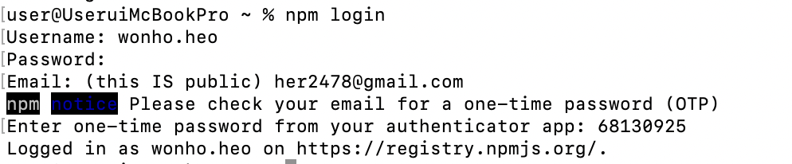

---
emoji:
title: 오픈소스 개발(NPM + Github)
date: '2023-02-01 16:18:00'
author: 허원호
tags: npm, github
categories: 블로그
---

# 오픈소스 개발(NPM + GitHub)

# NPM(Node Package Manager)

### NPM 개념

- 소프트웨어의 라이브러리 또는 레지스트리의 역할
- Node.js의 패키지관리자로 생성되었기 때문에 Node.js 설치 시 함께 설치됨

### Package.json

- npm으로 설치한 패키지가 정의되는 파일
- npm init 시 최초 해당파일이 생성되며 npm install 진행 시 해당 파일에 패키지가 명시됨

### Package-lock.json

- Package.json과 달리 npm init 시에 생성되지 않으며 npm 패키지를 설치, 수정, 삭제 등을 진행할때 생성되며 각 패키지의 의존성관리를 목적으로함
- 각각의 패키지에서 특정 패키지를 여러 패키지에서 사용할 수 도 있고 특정 패키지의 다양한 버전을 다른 패키지에서 사용할 수 있음. 이러한 경우 버전간의 충돌로 인해 빌드가 되지않거나 오류가 발생하는 것을 방지하기위해 존재함

### 패키지 공유

- NPM Registry에 배포하여 공유할 수 있음
- 가입과 사용은 무료이나 일부 개인적 권한을 이용하기 위해서는 요금을 부과

### 패키지 만들기

1. npm init

   ```jsx
   npm init -y
   ```

   - 위의 명령어를 통해 package.json 생성

   > -y 옵션을 넣지 않을 경우 package.json 에 들어가는 값들을 직접 설정하여 생성할 수 있음

2. npm login

   ```jsx
   npm login
   ```

   

   로그인이 성공적으로 진행되었을경우 아래 명령어를 통해 현재 로그인정보를 확인할 수 있음

   ```jsx
   npm whoami
   ```

3. npmignore
   - 개발 시에는 필요한 파일이나 npm 배포 시 불필요한 파일들을 제외해주는 역할
   - .gitignore와 같이 .npmignore 파일을 생성하여 제외처리
4. npm publish

   ```jsx
   npm publish
   ```

   - 배포 이전 실행해야할 명령어가 존재할 경우 package.json을 수정
     ```jsx
     // 예시
     "script": {
     	...
     	"prepare": "rm -rf dist && tsc"
     }
     ```
     - prepare 명령어를 선언할 시 npm publish 명령어를 실행할 때 해당 명령어를 실행하게됨

5. npm version

   - 배포한 라이브러리를 수정하고 재배포 해야할 경우 버전 변경이 필요함
   - package.json을 직접수정하고 배포를 진행해도 되지만 명령어를 통해서 가능

   ```jsx
   // 기존 버전이 1.0.0 이라 가정
   npm version patch // 1.0.1 - 호환 되면서 버그 수정
   npm version minor // 1.1.0 - 호환은 되지만 새로운 기능 추가 (정상동작 안할 수 도 있음)
   npm version major // 2.0.0 - 호환되지 않을 정도로 새롭게 바뀜
   ```
