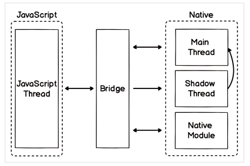

---
emoji:
title: React Native
date: '2023-02-03 16:18:00'
author: 허원호
tags: react, native, javascript, android, ios
categories: 블로그
---

# React Native

## React Native 란

- iOS, Android 에서 동작하는 네이티브 모바일 앱을 만드는 자바스크립트 프레임워크
- HTML, CSS, JS 기반의 웹뷰(webview) 방식이 아닌 네이티브 엘리먼트를 사용하여 구현
- Web, Windows, Mac OS, tvOS 기반 등의 Android, iOS 뿐만 아닌 타 플랫폼도 지원함

### 장점

- **러닝커브** : Javascript 기반 개발자의 경우 타 네이티브 앱 개발에 비해 진입장벽이 매우낮음
- **높은 재사용성** : 작성된 코드 대부분 플랫폼 간의 공유가 가능해서 iOS, Android를 동시에 개발 할 수 있다.
- **Fast Refresh** : 변경된 코드를 저장하기만 해도 자동으로 변경된 내용이 화면에 적용된다. 이 기능으로 `수정 > 컴파일 > 새로고침` 등의 작업을 생략하고 불필요한 작업시간을 줄일 수 있다.
- **성능 저하 문제점 해결** : 작성된 코드에 따라 각 플랫폼에 알맞은 네이티브 엘리먼트로 전환되기 때문에 큰 성능 저하 없이 개발이 가능하다.
- **쉬운 접근성** : 모바일에 대한 개발 지식이 없어도 자바스크립트만 알고 있으면 쉽게 시작할 수 있다.

### 단점

- **네이티브 앱 지식 필요** : 각 애플리케이션 개발에 있어 새로운 기능이 나올 시 리액트 네이티브가 이를 지원하기까지 기다려야된다는 점, 오픈소스가 존재하지 않는 기능을 개발할 경우 iOS, Android 지식 없이는 개발에 어려움이 있음
- **유지보수 및 디버깅 한계** : 디버깅과 유지보수가 쉬운 `React`와 달리 `React Native`는 디버깅이 어려워 개발 단계에서 문제가 생겼을 때 문제의 원인을 찾기까지 많은 시간이 소요된다.
- **잦은 업데이트** : 한두달 사이에도 업데이트가 자주 이뤄지기 때문에 버그를 수정하고 기능을 추가하는데는 긍정적이지만 너무 잦은 업데이트가 개발에 방해가 되기도한다.
- **성능 저하 :** 네이티브 브릿지를 사용해 동작되기 때문에 순수 네이티브 앱에 비하면 성능이 떨어짐. 일반적인 어플리케이션에서는 문제가 없지만 60프레임이상 사용하는 경우 등에서 성능저하가 발생할 수 있음.
- **기존의 UI 라이브러리 지원 :** React Native에서 HTML 사용 시 어플리케이션 빌드 과정에 오류가 발생하기 때문에 기존의 HTML 기반 UI 라이브러리는 사용이 불가능함

## React Native 특징

### Bridge

- 리액트 네이티브가 네이티브 코드로 변환되는 과정에는 `Bridge`가 필요하다.
- 리액트 네이티브에는 자바스크립트 코드를 이용해서 네이티브 계층과 통신할 수 있도록 연결해주는 역할의 `브릿지(bridge)`가 있다.



- `JavaScript Thread` : 자바스크립트의 코드가 실행되는 장소 \*(보통 리액트 코드로 구성되어있다.)
- `Native` : 네이티브 계층 코드

  - `Main Thread` : `UI`를 담당하는 메인 스레드
  - `Shadow Thread` : 백그라운드 스레드로 레이아웃을 계산하는데 사용된다.
  - `Native Module` : 각 모듈의 자체 스레드

- 다음 그림과 같이 `Bridge`가 자바스크립트 스레드에서 정보를 받아 네이티브로 전달하게 된다. 이렇게 `RN`이 기기와 통신하는 모든 자바스크립트의 기능을 분리된 스레드로 처리하면서 성능 향상을 가져온다.

참고: [https://ssollacc.tistory.com/14](https://ssollacc.tistory.com/14), [https://velog.io/@koreanhole/React-Native의-작동원리](https://velog.io/@koreanhole/React-Native%EC%9D%98-%EC%9E%91%EB%8F%99%EC%9B%90%EB%A6%AC)

### Core Components

| React Native   | Android View   | IOS View         | Web                   |
| -------------- | -------------- | ---------------- | --------------------- |
| `<View>`       | `<ViewGroup>`  | `<UIView>`       | `<div>`               |
| `<Text>`       | `<TextView>`   | `<UITextView>`   | `<p>`                 |
| `<Image>`      | `<ImageView>`  | `<UIImageView>`  | ``               |
| `<ScrollView>` | `<ScrollView>` | `<UIScrollView>` | `<div>`               |
| `<TextInput>`  | `<EditText>`   | `<UITextField>`  | `<input type=”text”>` |

### Metro

- React Native의 Javascript 번들러
- 프로젝트내의 코드와 패키지들을 합친 하나의 Javascript 파일을 전달
- 애플리케이션에 알맞는 포맷으로 빌드되어 실행됨

### CodePush

- **CodePush란?!**
  - [CodePush](https://github.com/microsoft/react-native-code-push)는 MS에서 만든 오픈소스로 React Native 또는 Apache Cordova로 개발한 앱을
    심사과정 없이 바로 업데이트 할 수 있도록 해주는 서비스
  - 수정된 업데이트 (JS Bundle과 assets)를 AppCenter 서버에 업로드하면 모바일 클라이언트는 앱 시작 시 마다 업데이트 버전이 있는지 확인하여 동기화 시켜줌 (이미지 출처:[링크](https://medium.com/humanscape-tech/react-native-code-push%EB%A1%9C-%EB%B0%B0%ED%8F%AC%ED%95%98%EA%B8%B0-26b320d87f8))
    
  - 코드 푸시로 할 수 있는 일
    - 오타 수정하기
    - 새 페이지 만들기
    - 라우팅 수정하기
    - 사진(이미지) 바꾸기
    - pod install 을 하지 않는, 네이티브 의존성을 가지지 않는 패키지의 추가
    - 기타 등등 JS 영역 내 에서의 수정사항
  - 코드 푸시로 할 수 없는 일
    - pod install 과 같은 네이티브 의존성을 가지는 패키지의 추가
    - 앱 아이콘 바꾸기
    - 새 권한 추가하기
    - Xcode 나 Android Studio를 열어서해줘야 하는 대부분의 변경사항들
    - 네이티브 코드를 직접수정해야 하는 부분들
- 설치 및 사용 방법
  1. AppCenter 가입 및 설정
     1. (추후 작성 예정)
  2. codepush 패키지 설치
  3. IOS & Android 설정
  4. 다중 배포 설정
  5. CodePush 고차 컴포넌트 추가
  6. 업데이트 로직 정의
  7. 릴리즈

## React Native 환경구성

- Expo-cli
  - 장점
    - React Native 개발에 필요한 환경구성이 미리 셋팅되어 처음 개발을 진행할 시 매우 쉽게 진행가능함
    - 네이티브 폴더가 숨겨져있고 알아서 관리해줌
  - 단점
    - Expo에서 제공되는 API만 사용이 가능하여 필요한 기능은 직접 모듈로 만들어 제작해야함
    - ios, android 폴더가 숨겨져 있다보니 native 파일을 직접 제어하기 어려움 (expo eject 명령어로 해결가능 한 것으로 보임)
      💾 설치
  ```jsx
  npm install -g expo-cli
  ```
  💾 시작
  ```jsx
  expo init 프로젝트명
  ```
- React-Native-cli
  💾 **설치**
  ```
  npm install -g react-native-cli
  ```
  💾 **시작**
  ```
  react-native init 프로젝트명
  ```
- Android Studio
  1. Android Studio 설치
     1. [다운로드](https://developer.android.com/studio) 및 아래 3개 항목 설치
        - `Android SDK`
        - `Android SDK Platform`
        - `Android Virtual Device`
  2. Android SDK 설치
     1. `Android SDK Platform 29`
     2. `Intel x86 Atom_64 System Image` or `Google APIs Intel x86 Atom System Image`
  3. ANDROID_HOME 환경변수(MAC)
     1. bash일 경우 ~/.bash_profile or ~/.bashrc 파일에 zsh일 경우 ~/.zprofile or ~/.zshrc 에 환경변수 입력
     2. 환경변수 코드
        1. export ANDROID_HOME=$HOME/Library/Android/sdk
        2. export PATH=$PATH:$ANDROID_HOME/emulator
        3. export PATH=$PATH:$ANDROID_HOME/tools
        4. export PATH=$PATH:$ANDROID_HOME/tools/bin
        5. export PATH=$PATH:$ANDROID_HOME/platform-tools
- xcode(설정 X)

## 프로젝트 구동 시 발생에러 해결모음

### React Native Cli

- What went wrong:
  Could not determine the dependencies of task ':app:compileDebugJavaWithJavac'.

  > SDK location not found. Define location with an ANDROID_SDK_ROOT environment variable or by setting the sdk.dir path in your project's local properties file at '/Users/user/repository/react-native-test/android/local.properties'.

      - 프로젝트 내의 android 폴더내에 [local.properties](http://local.properties) 생성 및 아래 코드 추가

      ```jsx
      sdk.dir= /Users/user/Library/Android/sdk
      ```

- What went wrong:
  Execution failed for task ':app:installDebug'.
  > com.android.builder.testing.api.DeviceException: No connected devices!
      - Android Studio내의 Virtual Device Manger 에서 디바이스 생성 및 실행
- spawnSync adb ENOENT
  - 환경변수 설정 문제
    - export ANDROID_HOME=$HOME/Library/Android/sdk
      export PATH=$PATH:$ANDROID_HOME/emulator
      export PATH=$PATH:$ANDROID_HOME/tools
      export PATH=$PATH:$ANDROID_HOME/tools/bin
      export PATH=$PATH:$ANDROID_HOME/platform-tools
