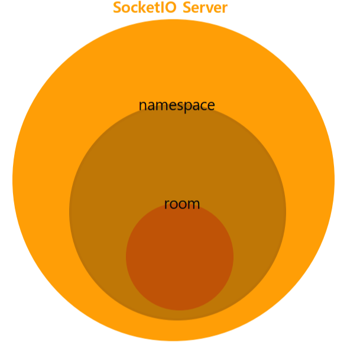
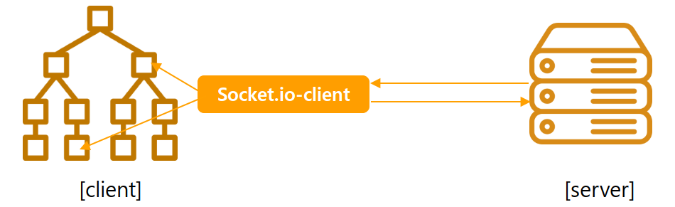

---
emoji:
title: Socket.io
date: '2023-02-01 16:18:00'
author: 허원호
tags: socket.io
categories: 블로그
---

# Socket.IO

## 1. 소개

- WebSocket을 기반으로 클라이언트와 서버의 양방향 통신을 가능하게해주는 모듈(라이브러리)

### WebSocket 기반의 통신을 사용하는 이유

- 데이터 송/수신이 계속 이루어져야 하는 어플리케이션 개발 시 http 프로토콜만 사용해서는 단방향방식의 특성상 서버에 데이터 업데이트가 존재하지 않았음에도 클라이언트에서 불필요한 요청을 계속 송신해야하기 때문에 굉장히 비효율적으로 동작함

### WebSocket 과의 차이점

- WebSocket - 양방향 통신을 위한 프로토콜
  - HTML5 웹 표준 기술
  - 매우 빠르게 작동하며 통신할 때 아주 적은 데이터를 이용함
  - 이벤트를 단순히 듣고, 보내는 것만 가능함
- Socket.io
  - WebSocket의 경우 오래된 브라우저의 경우 지원되지 않는문제가 있는데 [Socket.io](http://Socket.io) 사용으로써 해결 가능
  - 표준 기술이 아니며, 라이브러리임
  - 소켓 연결 실패 시 fallback을 통해 다른 방식으로 알아서 해당 클라이언트와 연결을 시도함
  - 방 개념을 이용해 일부 클라이언트에게만 데이터를 전송하는 브로드캐스팅이 가능함
  - WebSocket 통신만이 아닌 polling, streaming등의 방법도 지원
    - polling - 정기적으로 HTTP 요청을 전송하고 응답을 받는 방식이다. 따라서 데이터 변동이 없을 때도 불필요한 요청이 발생한다.
    - streaming - 서버와 클라이언트간 연결을 해제하지 않은 상태로 유지하는 방식이다. 하지만 동시에 하나의 포트를 이용한 데이터 전송이 불가능하다. 즉, 클라이언트가 서버로 데이터를 보내는 동안에는 서버가 클라이언트로 데이터를 보낼 수 없다는 것이다.(동시에 주고받기 위해서는 추가적으로 포트를 열어야 할 것이다.)

# 2. [Socket.io](http://Socket.io) 구조



- [socket.io](http://socket.io)에서는 namespace와 room의 단위를 가지게 되는데 하나의 socket.io 서버는 여러 개의 namespace를 가질 수 있으며 각각의 namespace의 경우 여러개의 room을 가질 수 있음

## 주의사항

- socket은 하나의 인스턴스로 충분함

  

  - 하나의 웹서비스에 소켓인스턴스를 전역에 단 하나만 존재하도록 작성하여 불필요한 리소스 낭비를 줄여야함

- 페이지를 벗어날 때 이벤트 제거

# 3. WebSocket 구현예제

- 서버 측 (Node.js)

```jsx
const WebSocket = require('ws');

const wss = new WebSocket.Server({ port: 3000 });

wss.on('connection', (ws) => {
  ws.on('message', (message) => {
    console.log('received: %s', message);
  });

  ws.send('something');
});
```

- 클라이언트 측

```jsx
const ws = new WebSocket('ws://localhost:3000');

ws.on('open', () => {
  ws.send('something');
});

ws.on('message', (data) => {
  console.log(data);
});
```

# 4. [Socket.io](http://Socket.io) 구현예제

### 기초

- 서버 측 (Node.js)

```jsx
const server = require('http').createServer();

const io = require('socket.io')(server);
io.on('connection', (socket) => {
  socket.on('message', (msg) => {
    console.log(msg);
  });
});

server.listen(3000);
```

- 클라이언트 측

```jsx
const io = require('socket.io-client');

const socket = io('http://localhost:3000');

socket.emit('message', 'hello world!');
```

### 실제적용예

- 서버 측 (Node.js)

  ```jsx
  *import* socketio from 'socket.io';

  const sio = socketio(server, {
    serveClient: false, // 클라이언트 파일을 제공할지 여부 (독립실행형 빌드에서 사용) default: true
    path: '/api/v1/socket', // 서버와 클라이언트를 연결할 경로 기본은 /socket.io/
    transports: ['websocket'], // 서버측에서 제공되는 low-level transport
  });
  ```

  - Room 설정

    ```jsx
    export const encodeRoomName = (type, pairs) => {
      switch (type) {
        case 'agg':
          const agg_array = [];
          if (Array.isArray(pairs)) {
            pairs.forEach((pair) => {
              agg_array.push(`agg@${pair}`);
            });
            return agg_array;
          } else {
            return `agg@${pairs}`;
          }
        case 'egg':
          const egg_array = [];
          if (Array.isArray(pairs)) {
            pairs.forEach((pair) => {
              egg_array.push(`egg@${pair}`);
            });
            return egg_array;
          } else {
            return `egg@${pairs}`;
          }

        default:
          break;
      }

      return null;
    };

    export const parseRoomName = () => {};
    ```

- 클라이언트가 커넥션시 동작 처리

  ```jsx
  sio.on('connection', (socket) => {
    logger.info(socket.handshake); // 핸드쉐이크 정보 로그기록
    socket.on('subscribe', (params) => {
      try {
        var subscribe = JSON.parse(params);
        if (typeof subscribe === 'object') {
          logger.info(subscribe);
          socket.join(subscribe.rooms); // 클라이언트가 커넥션시 전송한 room으로 join
        }
      } catch (e) {
        logger.error(`socketio subscribe error: ${e}`);
        return false;
      }
    });

    socket.on('unsubscribe', (params) => {
      try {
        var unsubscribe = JSON.parse(params);
        if (typeof subscribe === 'object') {
          logger.info(unsubscribe);
          socket.leave(unsubscribe.rooms); // 클라이언트를 room에서 내보냄
        }
      } catch (e) {
        logger.error(`socketio unsubscribe error: ${e}`);
        return false;
      }
    });
    socket.on('disconnect', (reason) => {
      logger.info(reason);
    });
  });
  ```

- 클라이언트 (Vue)

  - 초기 연결설정

    ```jsx
    // sio.js
    import SocketIO from 'socket.io-client';

    const sio = SocketIO({
      path: '/api/v1/socket',
      transports: ['websocket'],
    });

    export default sio;
    ```

  - Vue 설정

    ```jsx
    import VueSocketIOExt from 'vue-socket.io-extended';
    import sio from '@src/sio';
    import Vue from 'vue';
    import store from '@state/store';

    Vue.use(VueSocketIOExt, sio, {
      store,
    });

    // Vue에서 사용가능한 socket.io 라이브러리를 사용하면 Vuex store 와도 연계하여 사용가능
    ```

    - Vuex 네이밍 예시
      | Server Event | Mutation | Action |
      | ------------ | ------------------- | ------------------ |
      | chat message | SOCKET_CHAT_MESSAGE | socket_chatMessage |
      | chat_message | SOCKET_CHAT_MESSAGE | socket_chatMessage |
      | chatMessage | SOCKET_CHATMESSAGE | socket_chatMessage |
      | CHAT_MESSAGE | SOCKET_CHAT_MESSAGE | socket_chatMessage |

  - Vue component 내부 사용

    - 일반적인 Vue 형태

    ```jsx
    export default {
      sockets: {
        connect() {
          this.socketSubscribeRequest();
        },
      },
      methods: {
        socketSubscribeRequest() {
          const seq = this.seq;

          this.$socket.client.emit('subscribe', {
            room_name: encodeRoomName('agg', { seq }), // room 생성 상수
          });
        },
      },
    };
    ```

    - TypeScript decorator

    ```jsx
    <!-- App.vue -->
    <script>
    import Vue from 'vue'
    import Component from 'vue-class-component'
    import { Socket } from 'vue-socket.io-extended'

    @Component({})
    export default class App extends Vue {
      @Socket() // --> listens to the event by method name, e.g. `connect`
      connect () {
        console.log('connection established');
      }

      @Socket('tweet')  // --> listens to the event with given name, e.g. `tweet`
      onTweet (tweetInfo) {
        // do something with `tweetInfo`
      }
    }
    </script>
    ```

# 5. Server-instance

[https://velog.io/@hyex/socket.io-The-Socket-instance-server-side](https://velog.io/@hyex/socket.io-The-Socket-instance-server-side)

# 6. ClientAPI

[https://velog.io/@hyex/socket.io-사용할-Client-API](https://velog.io/@hyex/socket.io-%EC%82%AC%EC%9A%A9%ED%95%A0-Client-API)
