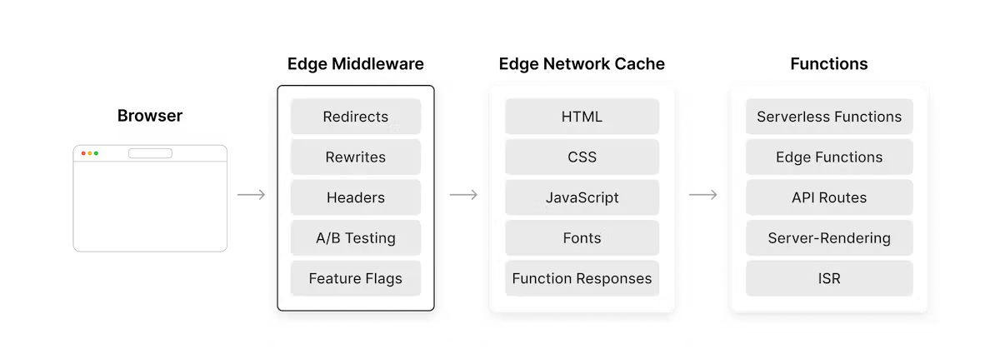

---
emoji:
title: Vercel Edge middleware
date: '2023-01-30 16:18:00'
author: 허원호
tags: Vercel
categories: 블로그
---

# Vercel Edge middleware

Edge middleware란 사이트에서 요청이 처리되기 전에 실행되는 코드입니다.

요청에 따라 응답을 수정할 수 있습니다. **캐시보다 먼저 실행되기 때문에 middleware를 사용하는 것은 정적으로 생성된 콘텐츠에 개인화를 제공하는 효과적인 방법입니다.**

들어오는 요청에 따라 응답을 반환하기 전에 사용자 지정 논리를 실행하고 rewrite, redirect, headers 추가 등을 수행할 수 있습니다.

Vercel의 Edge Network에 전역적으로 배포되며 서버 측 로직을 방문자의 출처에 가까운 Edge로 이동할 수 있습니다.

미들웨어는 Chrome 브라우저에서 사용 하는 것과 동일한 고성능 V8 JavaScript 및 WebAssembly 엔진 에 구축된 Vercel Edge Runtime 을 사용합니다.

Edge Runtime은 Web Standard API(FetchEvent, Response, Request)의 하위 subset을 노출하고 확장합니다.

## Edge middleware API

Edge middleware 는 [Edge runtime](https://vercel.com/docs/concepts/functions/edge-functions/edge-functions-api) 에서 실행됩니다.

이 런타임은 들어오는 요청에 따라 응답을 조작하고 구성하는 방법을 더 잘 제어할 수 있도록 확장된 Web Standard API의 하위 subset을 노출합니다.

Edge Runtime은 V8 코드를 실행할 수 있지만 process, path 또는 fs와 같은 Native Node.js API에 액세스할 수 없습니다.

대신 fetch, request 및 response와 같은 웹 API에 액세스할 수 있습니다. API 계층은 설계상 최소화되어 크기를 작게 유지하고 성능을 빠르게 유지합니다.

### Edge middleware 제한사항

#### Node.js API 는 사용할 수 없습니다.

- Native Node.js API 는 지원되지 않습니다. (ex. 파일시스템에 대한 읽기 쓰기)
- Node 모듈 은 ES 모듈을 구현하고 Native Node.js API를 사용하지 않는 한 사용할 수 있습니다. (ex. path-to-regexp 패키지를 사용하여 경로 일치를 수행)
- ES 모듈을 사용하고 코드를 재사용 가능한 파일로 분할한 다음 응용 프로그램을 빌드할 때 함께 번들링 할 수 있습니다.
- require를 직접 호출하는 것은 허용되지 않습니다. import 경로를 정적으로 확인할 수 있을 때 동작 할 수 있지만 권장되지 않습니다. 대신 ES 모듈 사용하세요.

#### 동적 코드 실행으로 인한 런타임 오류 발생

- eval
- new Function
- 버퍼 parameter가 있는 WebAssembly.instantiate()

#### 최대실행기간

Edge middleware 실행의 최대 기간은 5초입니다.

#### 메모리

Edge Middleware는 최대 128MiB까지만 사용할 수 있습니다. 이 제한을 초과하면 실행이 중단되고 502 오류가 반환됩니다.

#### 코드 크기 제한

Edge middleware의 최대 크기는 JavaScript 코드, import 된 라이브러리 및 함수에 번들로 포함된 모든 파일을 포함하여 압축 후 1MiB입니다.

#### 환경변수에 대한 제한

Vercel은 최대 총 64KB 크기의 환경 변수를 허용하지만 Edge 미들웨어는 환경 변수당 5KB로 제한됩니다.

#### 요청 제한

- Maximum URL length: 14KiB
- Maximum request body length: 4 MiB
- Maximum number of request headers: 64
- Maximum request headers length: 16KiB

#### fetch API 제한

fetch API 최대 요청 수는 950 입니다

#### Date API 제한

Date.now()는 I/O 작업(ex: fetch) 이후에만 진행됩니다.
