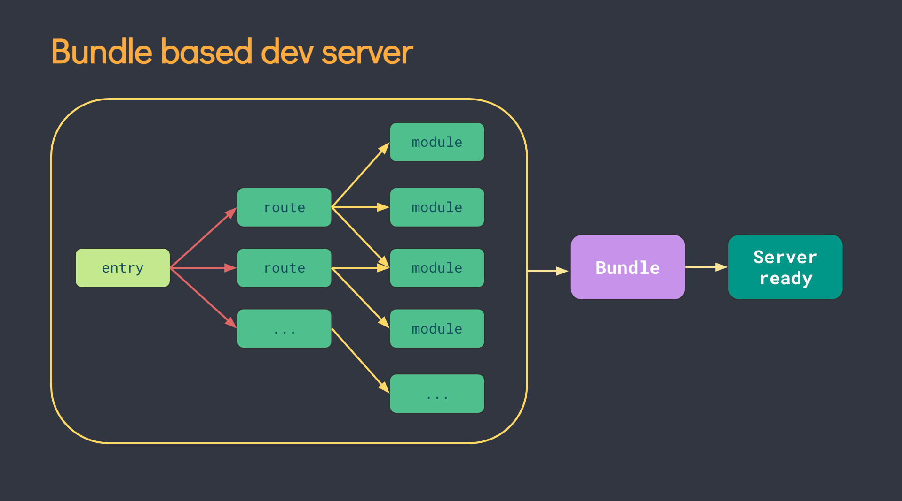
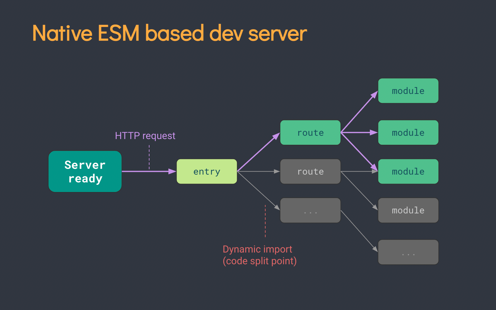

---
emoji:
title: Vite
date: '2023-02-03 15:18:00'
author: 허원호
tags: Vite, bundler, javascript
categories: 블로그
---

# Vite

# 소개

## 그동안의 프론트엔드 번들링의 문제점

1. 브라우저에서 ES module을 지원하기 전부터 Webpack, Rollup 등 과 같은 도구를 사용하여 번들링 작업을 통해 프론트엔드 개발을 진행
2. 하지만 Webpack과 같은 js 기반의 번들러의 경우 방대한 규모의 프로젝트를 번들링하는 과정에서 병목현상이 발생
3. 이를 해결하기위해 vite는 ES module 및 네이티브 언어로 작성된 번들러를 사용하여 문제를 해결

### 서버 구동

- Cold-Starting(최초로 실행되어 이전에 캐싱한 데이터가 없는 경우)방식으로 개발서버를 구동할 때 번들러 기반의 도구의 경우 모든 소스코드에 대해 빌드작업을 마쳐야만 완전한 페이지를 제공할 수 있었음
- vite는 dependencies 와 source code 두가지로 나누어 개발서버를 시작하도록 하여 해결
- Dependencies
  - **Esbuild**를 기반으로한 사전번들링 기능
  - **Esbuild**는 자바스크립트 기반이 아닌 **Go**로 작성되어 기존의 번들러 대비 10~100배 빠른 번들링속도를 자랑
- Source code
  
  

### 소스코드 갱신

- 기존의 번들러 기반으로 개발을 할 시 소스코드가 업데이트되면 재 번들링 과정을 통해 많은 시간을 코드반영에 소모
- 이를 해결하기 위해 HMR(Hot Module Replacement: 앱을 종료하지 않고 갱신된 파일만 교체하는 방식)이 나왔으나 앱의 규모가 커지면 커질수록 갱신에 필요한 시간이 증가ro
- vite는 ES module을 통한 HMR을 지원. 모듈이 수정될 시 해당 모듈만 교체하는 방식을 통해 시간을 단축

## 번들링 과정

- 개발 서버구동의 경우 앞서 설명한 방식대로 구동되지만 Esbuild의 code-splitting 및 css 관련 처리의 부족으로 인해 프로덕션 빌드의 경우에는 Esbuild를 사용하지 않음
- 그로인해 프로덕션 빌드시에는 Rollup을 사용하여 번들링 과정을 거침
- Rollup을 사용함으로 인해 Rollup기반의 빌드 커맨드와 관련 플러그인을 사용가능
