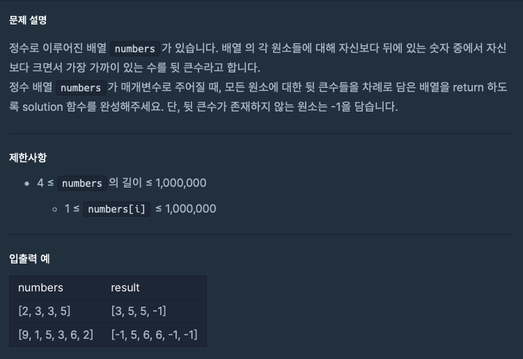

---
emoji:
title: 프로그래머스 코딩테스트 - 뒤에있는 큰 수 찾기
date: '2023-02-10 15:26:00'
author: 허원호
tags: javascript, 코딩 테스트
categories: 프로그래머스
---

## 문제



## 풀이

문제의 numbers 인자의 길이를 확인하지 못하고 현재 index 이후 가장 가까운 큰값을 구하는 로직을 작성하여 테스트를 진행해버렸다.

아니나 다를까 numbers 배열의 길이가 긴 테스트가 진행되자 시간초과...

```javascript
function solution(numbers) {
  return numbers.map((v, i) => {
    const diffArray = numbers.slice();
    diffArray.splice(0, i + 1);

    const findValue = diffArray.find((val) => val > v);
    if (findValue) {
      return findValue;
    } else {
      return -1;
    }
  });
}
```

힌트를 보니 stack을 사용해야 한다고 하여 stack의 형태로 구조를 변경하였더니 테스트 통과에 성공했다!

```javascript
function solution(numbers) {
  const stack = [];
  const answer = new Array(numbers.length);
  answer.fill(-1);

  for (let i = 0; i < numbers.length; i++) {
    if (!stack.length || numbers[i] < numbers[i - 1]) {
      stack.push(i);
    } else {
      while (stack.length && numbers[stack[stack.length - 1]] < numbers[i]) {
        answer[stack.pop()] = numbers[i];
      }
      stack.push(i);
    }
  }

  return answer;
}
```
