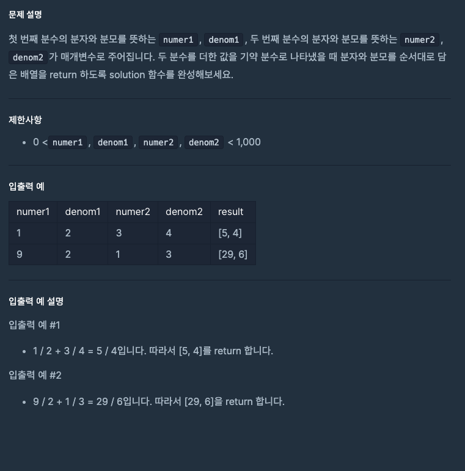

---
emoji:
title: 프로그래머스 코딩테스트 입문 - 둘만의 암호
date: '2023-03-20 23:29:00'
author: 허원호
tags: javascript, 코딩 테스트
categories: 프로그래머스
---

# 레벨 0

## 문제



## 풀이

분모의 최소 공배수를 구한 뒤 덧셈을 한 후 최대공약수를 구해 기약 분수로 변환해주는 문제였다.

최초 구현 시 기약분수처리를 고려하지 않아 테스트가 실패하여 최대공약수를 구하는 함수를 추가하여 수정하였다.

```javascript
function solution(numer1, denom1, numer2, denom2) {
  const lcm = getLCM(denom1, denom2);
  const t = [lcm / denom1, lcm / denom2];

  var answer = [t[0] * numer1 + t[1] * numer2, t[0] * denom1];
  const gcd = getGCD(answer[0], answer[1]);
  return answer.map((v) => v / gcd);
}

function getLCM(num1, num2) {
  let num = 1;
  while (!(num % num1 === 0 && num % num2 === 0)) {
    num += 1;
  }
  return num;
}

function getGCD(num1, num2) {
  let num = 1;
  for (let i = 2; i <= Math.min(num1, num2); i++) {
    if (num1 % i === 0 && num2 % i === 0) {
      num = i;
    }
  }
  return num;
}
```
