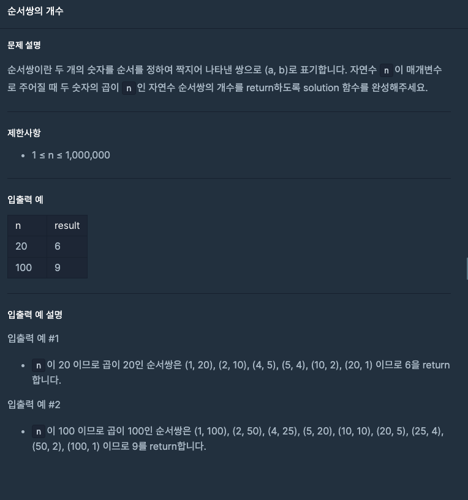

---
emoji:
title: 프로그래머스 코딩테스트 입문 - 순서쌍의 개수
date: '2023-04-03 22:37:00'
author: 허원호
tags: javascript, 코딩 테스트
categories: 프로그래머스
---

# 레벨 0

## 문제



## 풀이

자연수 n이 주어졌을 떄 n의 순서쌍을 구하는 문제였다

n의 약수의 갯수가 곧 순서쌍의 갯수라고 생각하여 약수를 구하도록 구현하였다

```javascript
function solution(n) {
  const array = [];
  for (let i = 1; i <= n; i++) {
    if (n % i === 0) {
      array.push(i);
    }
  }
  return array.length;
}
```

아니나다를까 성공하여도 효율성이 너무떨어진다. 가장 많은 추천을 받은 풀이를 보았더니 제곱근을 활용하였다

```javascript
function solution(n) {
  let ans = 0;
  for (let i = 1; i < Math.sqrt(n); i++) {
    if (n % i === 0) {
      ans += 2;
    }
  }

  return Number.isInteger(Math.sqrt(n)) ? ans + 1 : ans;
}
```

반복 수가 반으로 줄어들어 훨씬 효율적인 코드였다.
나중에 유사한 문제에서 활용해 볼 수 있도록 메모!
