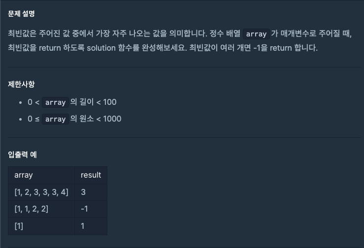

---
emoji:
title: 프로그래머스 코딩테스트 입문 - 최빈값 구하기
date: '2023-03-26 23:33:00'
author: 허원호
tags: javascript, 코딩 테스트
categories: 프로그래머스
---

# 레벨 0

## 문제



## 풀이

주어진 배열의 최빈값을 구하는 문제였다

배열내의 동일한 수를 저장하기위해 객체를 만들어 key에 array의 value를 value에 array value의 동일한 숫자의 갯수를 저장하였다

```javascript
function solution(array) {
  var answer = {};

  array.forEach((v) => {
    if (!answer[v]) answer[v] = 1;
    else answer[v] += 1;
  });

  const keyArray = Object.keys(answer);
  const valueArray = Object.values(answer);
  let maxValue = 0;
  let key = 0;

  for (var value of keyArray) {
    if (answer[value] > maxValue) {
      maxValue = answer[value];
      key = value;
    }
  }

  return valueArray.filter((v) => v === maxValue).length > 1 ? -1 : parseInt(key);
}
```

문제는 어떻게든 해결하였으나 과연 효율적인가 라는 의구심이 계속들었다
다른 사람의 풀이를 보니 Set을 사용한 해결 풀이가 많아 Set을 통해 코드를 개선해보았다

```javascript
function solution(array) {
  let map = new Map();
  for (let n of array) map.set(n, (map.get(n) || 0) + 1);
  map = [...map].sort((a, b) => b[1] - a[1]);
  return map.length === 1 || map[0][1] > map[1][1] ? map[0][0] : -1;
}
```

map을 통해 object key value 변환 과정을 최소화 하는 코드이며
sort를 사용하여 가장 첫번째 인덱스에 array 내에 가장 많이 나온 값을 우선적으로 정렬하였다
